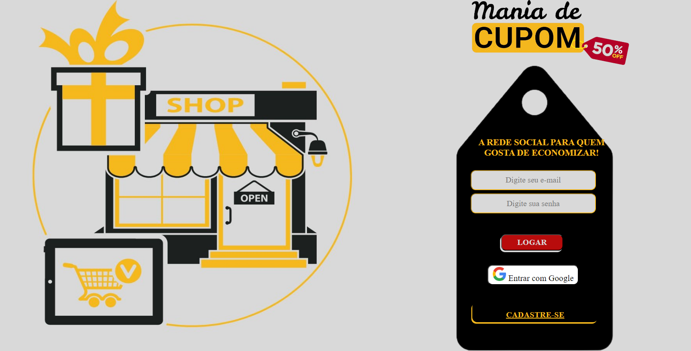
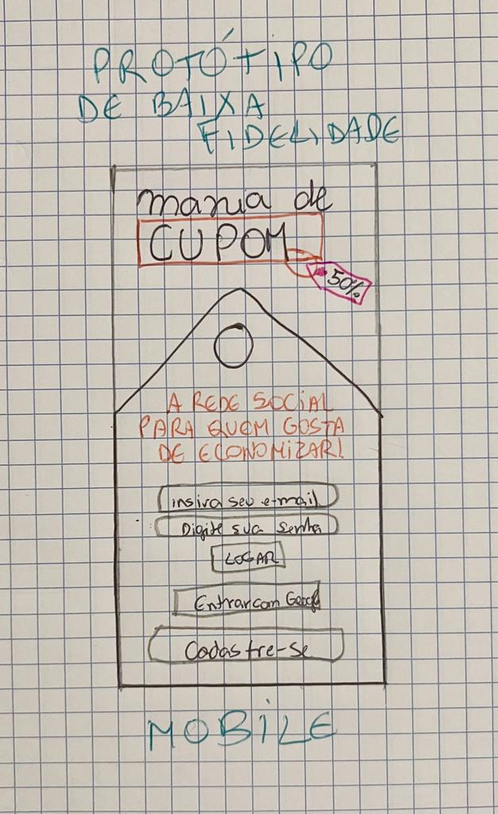
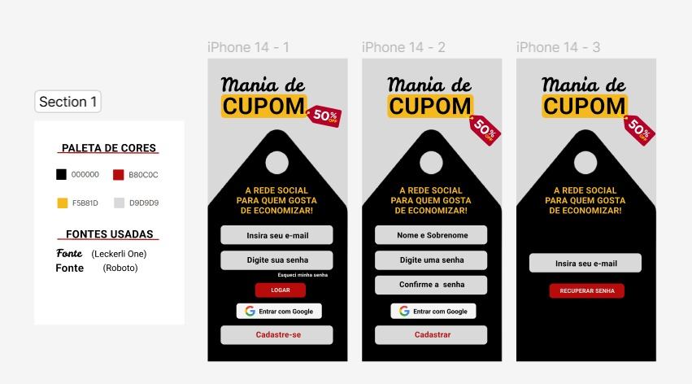
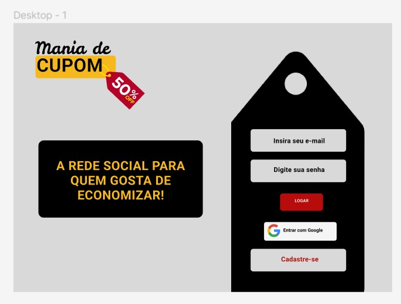
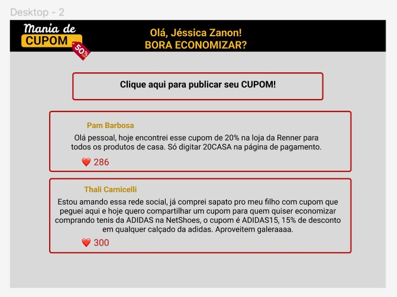
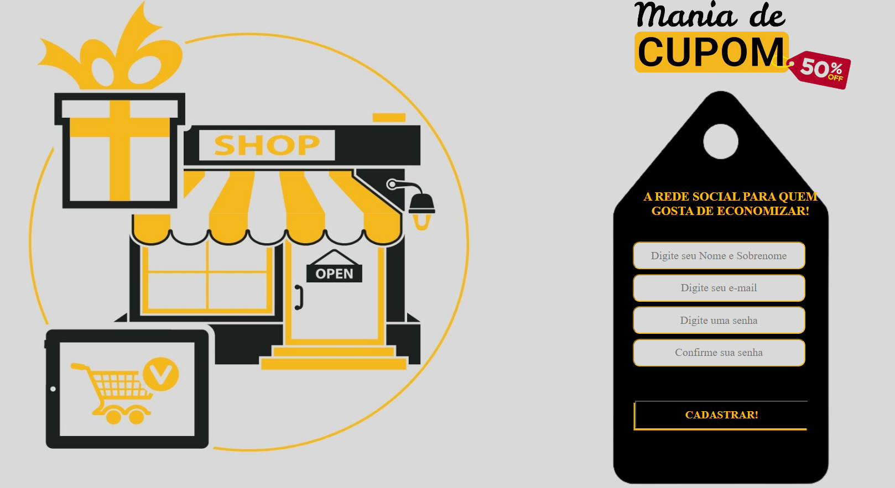
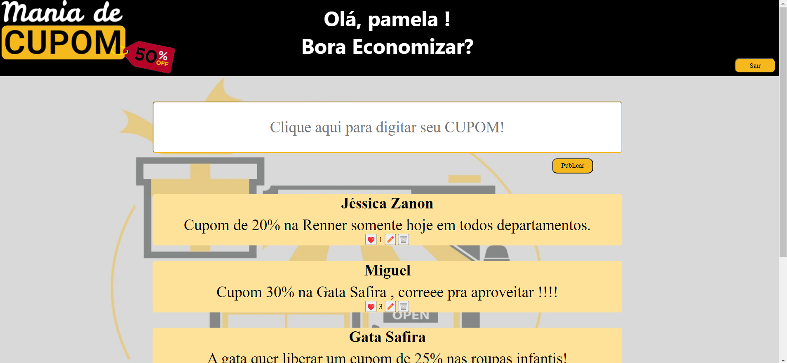
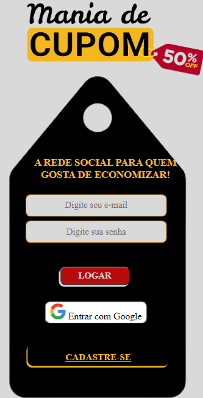
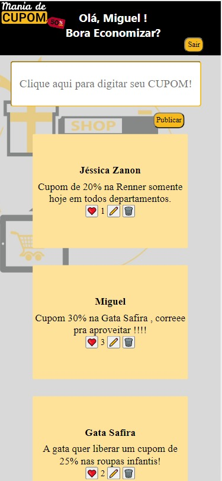

# REDE SOCIAL MANIA DE CUPOM

## Tecnologias e Ferramentas utilizadas:

----
## Índice

[*1. Resumo do Projeto](#1-resumo-do-projeto)

[*2. História do Usuário](#2-história-do-usuário)

[*3. Desenvolvimento do Site](#3-desenvolvimento-do-site)

[*4. Teste de Usabilidade](#4-testes-de-usabilidade)

[*5. Desenvolvedoras](#5-desenvolvedoras)

----

## 1. Resumo do projeto

O "Social Network" foi o terceiro projeto proposto pela Laboratória com o objetivo de desenvolver um aplicativo de rede social. Nesse aplicativo, os usuários teriam a capacidade de navegar e compartilhar suas ideias com base em temas selecionados pelas desenvolvedoras. Além disso, esse projeto foi o primeiro a ser realizado em trio, o que aumentou o desafio para as graduandas. Ele foi estruturado para simular um ambiente de trabalho corporativo, onde as tarefas foram divididas entre os colaboradores, proporcionando uma experiência prática e colaborativa.

----
## 2. História do Usuário
Neste projeto nós construímos um aplicativo de rede social (MANIA DE CUPOM) que permite ao usuário compartilhar e aproveitar os cupons que foram publicados por outros usuários. A ideia é divulgar as promoções e interagir com mais pessoas que sejam apaixonadas por economizar.

O usuário poderá se cadastrar no aplicativo com seus dados e/ou entrar com o login do google. Na plataforma poderá publicar seus cupons, editar e excluir, além de curtir postagens de outras pessoas.

----
## 3. Desenvolvimento do Site

Iniciamos com uma pesquisa de mercado com possíveis usuários e quando entrevistados, todos responderam que usariam essa rede social se fosse gratuita. E alguns deram a ideia de implementar vídeos e jogos para obter cupons de descontos.

Fizemos um protótipo de baixa fidelidade, desenhamos num papel mesmo para entender melhor o que gostaríamos de criar.

PROTÓTIPO DE BAIXA FIDELIDADE:

E depois desenhamos no Figma um protótipo de Alta Fidelidade para ficar um aplicativo mais parecido com a realidade. Fizemos o protótipo para todas as telas que gostaríamos de implementar no nosso projeto, tela de login, de cadastro e o feed, tanto versão mobile quanto web.

PROTÓTIPOS DE ALTA FIDELIDADE

Além disso utilizamos o Trello como ferramenta de organização e ali conseguimos ver o App tomando forma. Utilizamos SPA, Firebase e Firestore para o banco de dados em nuvem, armazenando as informações do usuário, publicando, editando e excluindo com atualização em tempo real. 

Fizemos testes unitários com Jest, além de  uso de condicionais para permitir contas válidas, não cadastrar o usuário mais de uma vez, usar senha com no mínimo 6 dígitos, tudo isso com mensagens descritivas de alerta para ajudar o usuário. 

Com o trio para trabalhar com git foi um desafio que superamos, muitos commits e branches que foram criadas para que tudo acontecesse da melhor forma. Aprendemos comandos novos que usaremos pra vida.

O aplicativo foi tomando forma e com isso fizemos algumas alterações, principalmente no CSS para ficar mais interessante para o usuário. Fizemos responsividade usando o Media Query para fazer os ajustes e deixar o app responsivo para diferentes formatos de telas.

TELA HOME DE DESKTOP

TELA DE CADASTRO DESKTOP

TELA DE FEED DESKTOP

TELA HOME PARA MOBILE

TELA FEED PARA MOBILE

## 4. Teste de Usabilidade

Durante o processo de elaboração do projeto, inicialmente consideramos uma paleta de cores que fizesse sentido com o mundo das promoções, descontos e cupons. 

Nosso projeto apresentava uma tela de login com um texto ao lado, mas ao longo do tempo sentimos falta de uma imagem para deixar mais harmônico. Alteramos pouca coisa do protótipo para o final do projeto, fizemos ajustes de acordo com o que víamos que fazia mais sentido para o usuário.

Por último, adequamos o tamanho das fontes, imagens e o espaçamento entre linhas e elementos, buscando melhorar a navegação do usuário em telas menores.

----
## 5. Desenvolvedoras

- Jéssica Zanon : [Linkedin](https://www.linkedin.com/in/j%C3%A9ssica-zanon-b532b0253/) | [GitHub](https://github.com/jesszanon)

- Pamela Barbosa : [Linkedin](https://www.linkedin.com/in/pamelabrsa/) | [GitHub](https://github.com/PamelaBrsa)

- Thalita Carnicelli :  [GitHub](https://github.com/Thalita-Carnicell)